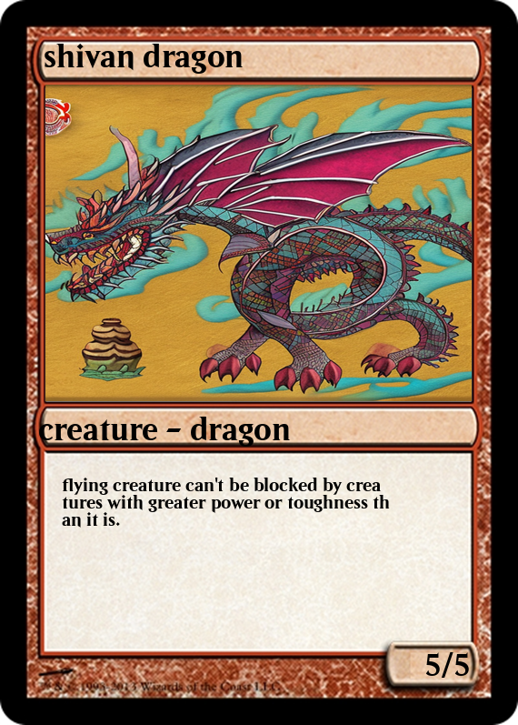

## capstone ##
Capstone project Elliott jones 2023.

## Project statement ##
For my capstone project I fine-tuned 6 chat gpt-2 models based on magic the gathering cards to prepare them to generate user text based on prompts, with the goal to get them to be unrecognizable from actual magic cards.
I analyzed how good each model was with a countvectorizor classification model to see how good the text generated was compared to actual rules text.
Then I uploaded those generated models onto anvil with a simple image generator model from hugging face to generate a full magic card based on user input.

## Dictionary ##
This repo has 3 folders:
* code

Code has 2 local notebooks: mtg_csv_eda_backup where the majority of the data cleaning and classification modeling is done, and image diffuser test, a testing notebook showing how to implement a stable diffusion pipeline on the local machine. Finally fresh model making.iypnb used a streamlit app before anvil was working to create a magic card from text. The rest of the notebooks are google collab copies with links included here, most of the work for this project was done on collab due to the nature of how large these models are, links are included below to each notebook.

* https://colab.research.google.com/drive/1z8eky7TweHzHjeiiycCLL1dEE2i6nnXb?usp=sharing (generating text based on all cards, both chat)
* https://colab.research.google.com/drive/1yqR9kcOwFuB37GiCMX1T5QP-8vJ5Ej-y?usp=sharing (checkpoint generator for each of the models)
* https://colab.research.google.com/drive/1zvA9e6rbFpVYKaVdgZUw6vqTJAJMc7D2?usp=sharing (image generation and final anvil collab file)
 
* imagefiles

imagefiles contains the image templates for a magic card of each of the 5 bae colors as well as the beleren text to make it look slightly more like a real card.
* csvs

csvs contains the output of each model as a csv used for classification

## data source ##
For the models I had to store all of them on collab the link to that folder is here if you want to set this up on your own you'll have to mount this file to your google drive.

https://drive.google.com/drive/folders/1MMjuFyDNQVkAqda1KcwAVoTISK__F_Kd?usp=sharing 

## Analysis ## 

Processing power is the number 1 restraint for this project, it was effectively impossible to store and train the models on my laptop and effectively train them.
So the gpt2 models are only trained on 100 steps, when i got much better results after 300 or 1000 steps, this necessitated me to learn anvil and google collab storage to complete the project.
With greater processing power and time, one could achieve much better models that were much better at fooling more advanced types of classifiers and the human eye.

## Sample ##

This is what the final product of the project looks like, the anvil app can generate a magic card like this with an AI generated image and textbox from user input of the card's name, type, and subtype.

## Conclusions ##

In this project I laid the groundwork for being able to develop AI magic cards, and I don't think within the distant future it will be especially difficult. 
The tools I used in this project are free and accessible online and took em a couple weeks to learn, any company with a decent computer could finetune my results further and produce their own card game,
along with art to make it for any existing card game. If I were to take this process further the first thing I'd do is use the more intensive gpt models(I used the lightest version because of time), train them for longer, and apply some additional regex to make the text more friendly to humans. I'm fairly happy with how this project turned out and might pursue it more if I get a better computer.
